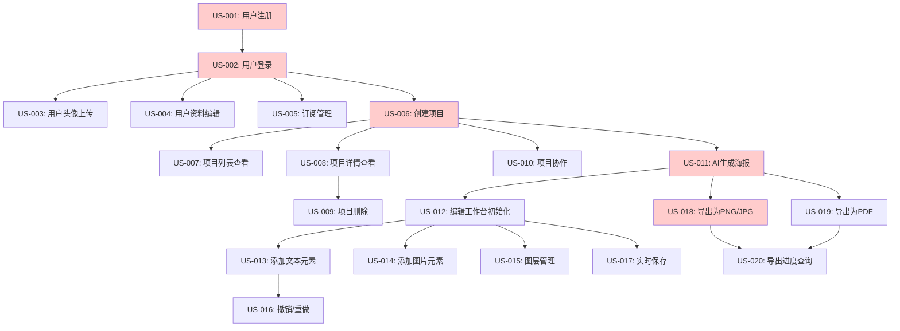

# 智绘海报项目 - 用户故事地图_MVP阶段

**版本**: V1.0
**创建日期**: 2025年10月26日
**项目周期**: MVP阶段 (12周)
**文档状态**: 正式版

---

## 📋 目录

1. [用户故事地图总览](#用户故事地图总览)
2. [详细用户故事拆分](#详细用户故事拆分)
3. [开发顺序规划](#开发顺序规划)
4. [风险识别和应对](#风险识别和应对)
5. [总体工时估算](#总体工时估算)

---

## 用户���事地图总览

### MVP阶段整体用户故事结构

#### 按模块分组

| 模块 | 故事数量 | 总工时估算 | 优先级分布 |
|------|---------|-----------|-----------|
| **用户管理** | 5个 | 18人日 | P0: 3个, P1: 2个 |
| **项目管理** | 5个 | 16人日 | P0: 4个, P1: 1个 |
| **设计编辑** | 7个 | 32人日 | P0: 5个, P1: 2个 |
| **导出管理** | 3个 | 14人日 | P0: 3个 |
| **总计** | **20个** | **80人日** | **P0: 15个, P1: 5个** |

---

### 用户故事依赖关系图



---

### 关键路径说明

**最短交付路径** (MVP核心流程):
```
US-001 → US-002 → US-006 → US-011 → US-012 → US-018
(注册 → 登录 → 创建项目 → AI生成 → 编辑器 → 导出)
```

**预计时间**: 核心路径 40人日 (前端20人日 + 后端20人日)

---

## 详细用户故事拆分

### 模块1: 用户管理 (5个故事)

---

## US-001: 用户注册

### 📋 基本信息
- **优先级**: P0 (阻塞MVP)
- **所属模块**: 用户管理
- **估算**: 前端 1.5人日 + 后端 2人日 + 测试 0.5人日 = **4人日**
- **依赖**: 无
- **Sprint**: Sprint 1 (Week 1-2)

### 📖 用户故事描述
作为 **新用户**,
我希望 **通过邮箱注册账号并接收验证邮件**,
以便 **开始使用智绘海报创建设计项目**。

### ✅ 验收标准

**AC1: 注册表单验证**
- Given 用户访问注册页面
- When 用户输入邮箱、用户名、密码
- Then 系统实时验证格式 (邮箱格式、密码>=8字符、用户名唯一性)

**AC2: 邮箱验证流程**
- Given 用户提交有效注册信息
- When 系统创建账号
- Then 发送验证邮件到用户邮箱,账号状态为"未验证"

**AC3: 重复注册处理**
- Given 用户使用已注册的邮箱
- When 用户提交注册
- Then 显示错误提示"该邮箱已注册,请直接登录"

### 🎨 前端交付物

#### 页面/组件
- **页面**: `src/views/Auth/RegisterPage.vue`
  - 功能: 用户注册表单
  - 路由: `/register`
  - 权限: 公开访问

- **组件**: `src/components/Auth/RegisterForm.vue`
  - 功能: 注册表单组件 (邮箱、用户名、密码输入)
  - Props: { onSuccess: Function }
  - Emits: ['register-success', 'register-error']

#### 状态管理
- **Pinia Store**: `src/stores/authStore.ts`
  - State: { user: User | null, isAuthenticated: boolean, registerStatus: string }
  - Actions: ['register', 'verifyEmail']

#### API 集成
- `POST /api/v1/auth/register` - 提交注册信息
- `POST /api/v1/auth/verify-email` - 验证邮箱

#### UI 规范参考
- 参考: `UI_设计系统和Wireframe.md` - 登录页面设计
- 组件库: Element Plus 的 Form 组件
- 样式: Tailwind CSS 类名 (bg-blue-500, text-white)

#### 交互流程参考
- 参考: `用户流程和交互设计.md` - 新用户首次使用流程

### 🔧 后端交付物

#### 微服务
- **服务名称**: user-service
- **端口**: 3001

#### API 端点
- **POST /api/v1/auth/register**
  - 请求体: { email: string, username: string, password: string }
  - 响应: { status: 201, data: { user_id: UUID, message: "验证邮件已发送" } }
  - 错误码: 400 (格式错误), 409 (邮箱已存在), 500 (服务器错误)

- **POST /api/v1/auth/verify-email**
  - 请求体: { token: string }
  - 响应: { status: 200, data: { message: "邮箱验证成功" } }

#### 数据模型
- **表名**: `users`
- **字段**:
  - id (UUID, PK)
  - email (VARCHAR(255), UNIQUE, NOT NULL)
  - username (VARCHAR(50), UNIQUE, NOT NULL)
  - password_hash (VARCHAR(255), NOT NULL)
  - is_email_verified (BOOLEAN, DEFAULT FALSE)
  - created_at (TIMESTAMP, DEFAULT NOW())
  - updated_at (TIMESTAMP)
- **索引**:
  - idx_users_email (email)
  - idx_users_username (username)

#### 业务逻辑
- 核心逻辑1: 使用 passlib + bcrypt 加密密码 (10轮)
- 核心逻辑2: 生成验证令牌 (UUID + 24小时过期)
- 数据验证: Pydantic 模型验证邮箱/用户名/密码格式

#### 异步任务
- **Celery 任务**: `tasks.send_verification_email`
- **队列**: `email_notification`
- **执行时间**: 预计 2-3 秒
- **重试策略**: 最多 3 次,指数退避

### 🔬 技术实现要点

#### 前端关键技术
- **Composable**: `useAuth()` - 封装认证逻辑
- **Pinia Store**: 管理用户认证状态
- **VueQuery**: 缓存用户信息
- **表单验证**: vee-validate + yup schema

#### 后端关键技术
- **SQLAlchemy 模型**: 异步 ORM 操作
- **Pydantic 验证**: UserCreate schema 验证
- **密码加密**: passlib.context.CryptContext
- **邮件服务**: SendGrid API集成 (Celery异步)

#### 性能优化
- 前端: 表单防抖验证,减少无效请求
- 后端: 数据库索引,快速查重 (<50ms)
- 网络: 邮件发送异步处理,不阻塞注册响应

#### 安全考虑
- 认证: 无 (注册为公开接口)
- 数据验证: 前后端双重验证
- SQL 注入防护: ORM 参数化查询
- XSS 防护: Vue 自动转义
- 密码安全: bcrypt 加密,不明文存储

### 🧪 测试用例

#### 单元测试
- **前端** (Vitest):
  - 测试表单验证逻辑
  - 测试注册成功/失败状态
  - 覆盖率目标: >80%

- **后端** (pytest):
  - 测试密码加密正确性
  - 测试邮箱唯一性检查
  - 测试验证邮件生成
  - 覆盖率目标: >85%

#### 集成测试
- **API 测试** (pytest + httpx):
  - 测试注册 API 完整流程
  - 测试重复注册处理
  - 覆盖率目标: >60%

#### E2E 测试
- **用户流程测试** (Playwright):
  - 测试完整注册流程 (填写表单 → 提交 → 邮箱验证)
  - 覆盖核心场景

### 📊 性能标准

- **API 响应时间**:
  - P50: < 100ms (不含邮件发送)
  - P95: < 200ms
  - P99: < 500ms

- **前端性能**:
  - 页面加载: < 1s
  - 表单验证响应: < 100ms

- **数据库查询**:
  - 邮箱/用户名查重: < 50ms

### ⚠️ 依赖和风险

#### 上游依赖
- 无

#### 技术风险
- **风险1**: SendGrid 邮件发送失败 - 概率: 低
  - 影响: 用户无法收到验证邮件
  - 缓解措施: 重试机制 + 备用邮件服务 (SMTP)

- **风险2**: 数据库连接池耗尽 - 概率: 低
  - 影响: 注册请求失败
  - 缓解措施: 连接池配置 (max_connections=20)

#### 外部依赖
- SendGrid 邮件服务 (API Key 配置)
- PostgreSQL 数据库

---

## US-002: 用户登录

### 📋 基本信息
- **优先级**: P0 (阻塞MVP)
- **所属模块**: 用户管理
- **估算**: 前端 1.5人日 + 后端 2人日 + 测试 0.5人日 = **4人日**
- **��赖**: US-001 (用户注册)
- **Sprint**: Sprint 1 (Week 1-2)

### 📖 用户故事描述
作为 **已注册用户**,
我希望 **通过邮箱和密码登录系统并获得访问令牌**,
以便 **安全访问我的项目和设计**。

### ✅ 验收标准

**AC1: 登录成功**
- Given 用户输入正确的邮箱和密码
- When 用户提交登录表单
- Then 系统返回 JWT AccessToken 和 RefreshToken,跳转到仪表板

**AC2: 登录失败**
- Given 用户输入错误的邮箱或密码
- When 用户提交登录表单
- Then 显示错误提示"邮箱或密码错误",不透露具体哪个字段错误

**AC3: Token 自动刷新**
- Given 用户的 AccessToken 快要过期 (<1小时)
- When 前端检测到即将过期
- Then 自动使用 RefreshToken 获取新的 AccessToken

### 🎨 前端交付物

#### 页面/组件
- **页面**: `src/views/Auth/LoginPage.vue`
  - 功能: 用户登录表单
  - 路由: `/login`
  - 权限: 公开访问

- **组件**: `src/components/Auth/LoginForm.vue`
  - 功能: 登录表单组件
  - Props: { redirectTo: string }
  - Emits: ['login-success', 'login-error']

#### 状态管理
- **Pinia Store**: `src/stores/authStore.ts`
  - State: { user: User | null, accessToken: string | null, isAuthenticated: boolean }
  - Actions: ['login', 'logout', 'refreshToken']
  - Getters: ['isLoggedIn', 'userRole']

#### API 集成
- `POST /api/v1/auth/login` - 用户登录
- `POST /api/v1/auth/refresh` - 刷新令牌
- `POST /api/v1/auth/logout` - 用户登出

#### UI 规范参考
- 参考: `UI_设计系统和Wireframe.md` - 页面1: 首页/登录页面
- 组件库: Element Plus 的 Form 组件
- 样式: Tailwind CSS (bg-primary, text-center)

#### 交互流程参考
- 参考: `用户流程和交互设计.md` - 场景1: 新用户首次使用 (第2步: 登录)

### 🔧 后端交付物

#### 微服务
- **服务名称**: user-service
- **端口**: 3001

#### API 端点
- **POST /api/v1/auth/login**
  - 请求体: { email: string, password: string }
  - 响应: { status: 200, data: { access_token: string, refresh_token: string, expires_in: 86400 } }
  - 错误码: 400 (格式错误), 401 (认证失败), 500 (服务器错误)

- **POST /api/v1/auth/refresh**
  - 请求体: { refresh_token: string }
  - 响应: { status: 200, data: { access_token: string, expires_in: 86400 } }
  - 错误码: 401 (Token无效/过期)

- **POST /api/v1/auth/logout**
  - 请求头: Authorization: Bearer {access_token}
  - 响应: { status: 204 }

#### 数据模型
- 使用 US-001 的 `users` 表
- 新增 `refresh_tokens` 表:
  - id (UUID, PK)
  - user_id (UUID, FK)
  - token_jti (VARCHAR(36), UNIQUE)
  - expires_at (TIMESTAMP)
  - created_at (TIMESTAMP)

#### 业务逻辑
- 核心逻辑1: 使用 passlib 验证密码哈希
- 核心逻辑2: 使用 PyJWT 生成 JWT Token (HS256算法)
- 核心逻辑3: RefreshToken 黑名单机制 (Redis存储已注销的Token)
- 数据验证: Pydantic LoginRequest schema

#### 异步任务
- 无 (登录为同步操作)

#### 缓存策略
- **Redis Key**: `session:{user_id}` - 存储用户会话状态
- **TTL**: 7天 (与 RefreshToken 有效期一致)
- **失效策略**: 用户登出时主动删除

### 🔬 技术实现要点

#### 前端关键技术
- **Composable**: `useAuth()` - 封装登录/登出/Token刷新
- **Pinia Store**: 全局认证状态管理
- **Axios 拦截器**: 自动添加 Token 到请求头,自动刷新 Token

#### 后端关键技术
- **JWT 认证**: PyJWT 库生成和验证 Token
- **密码验证**: passlib.context.CryptContext
- **Token 黑名单**: Redis 存储已注销的 RefreshToken JTI

#### 性能优化
- 前端: Token 存储在内存,避免频繁读取 localStorage
- 后端: 密码验证缓存 (相同密码验证结果缓存1分钟)
- 网络: Token 刷新使用 RefreshToken,减少密码传输

#### 安全考虑
- 认证: JWT Token 验证
- 授权: 无 (登录为认证接口)
- 数据验证: 前后端双重验证
- Token 安全: AccessToken 短有效期 (24小时), RefreshToken 存储在 HttpOnly Cookie
- 密码安全: bcrypt 加密,登录失败不透露具体错误字段

### 🧪 测试用例

#### 单元测试
- **前端** (Vitest):
  - 测试登录表单验证
  - 测试 Token 刷新逻辑
  - 测试登出清除状态
  - 覆盖率目标: >80%

- **后端** (pytest):
  - 测试 JWT Token 生成和验证
  - 测试密码验证逻辑
  - 测试 Token 黑名单机制
  - 覆盖率目标: >85%

#### 集成测试
- **API 测试** (pytest + httpx):
  - 测试登录 API 完整流程
  - 测试 Token 刷新流程
  - 测试登出后 Token 失效
  - 覆盖率目标: >60%

#### E2E 测试
- **用户流程测试** (Playwright):
  - 测试完整登录流程 (输入凭据 → 登录 → 跳转仪表板)
  - 测试登出流程
  - 覆盖核心场景

### 📊 性能标准

- **API 响应时间**:
  - P50: < 100ms
  - P95: < 200ms
  - P99: < 500ms

- **前端性能**:
  - 页面加载: < 1s
  - 登录响应: < 2s (含跳转)

- **数据库查询**:
  - 用户查询: < 50ms

### ⚠️ 依赖和风险

#### 上游依赖
- US-001: 用户注册 (必须先有注册用户)

#### 技术风险
- **风险1**: JWT Secret Key 泄露 - 概率: 低
  - 影响: Token 可被伪造
  - 缓解措施: 环境变量加密存储,定期轮换 Secret Key

- **风险2**: Redis 连接失败导致 Token 黑名单不可用 - 概率: 低
  - 影响: 已注销的 Token 仍然有效
  - 缓解措施: Redis 主从复制 + Sentinel 高可用

#### 外部依赖
- Redis (Token 黑名单存储)
- PostgreSQL 数据库

---

## US-003: 用户头像上传

### 📋 基本信息
- **优先级**: P1 (重要)
- **所属模块**: 用户管理
- **估算**: 前端 1人日 + 后端 2人日 + 测试 0.5人日 = **3.5人日**
- **依赖**: US-002 (用户登录)
- **Sprint**: Sprint 2 (Week 3-4)

### 📖 用户故事描述
作为 **已登录用户**,
我希望 **上传个人头像图片**,
以便 **个性化我的用户资料**。

### ✅ 验收标准

**AC1: 头像上传成功**
- Given 用户选择一张图片 (JPG/PNG, <5MB)
- When 用户点击"上传头像"
- Then 系统上传图片到 S3,裁剪为 200x200px,更新用户资料

**AC2: 文件格式验证**
- Given 用户选择非图片文件 (如 .pdf)
- When 用户尝试上传
- Then 显示错误提示"仅支持 JPG/PNG 格式"

**AC3: 文件大小验证**
- Given 用户选择超过 5MB 的图片
- When 用户尝试上传
- Then 显示错误提示"图片大小不能超过 5MB"

### 🎨 前端交付物

#### 页面/组件
- **页面**: `src/views/User/ProfilePage.vue`
  - 功能: 用户资料编辑页面
  - 路由: `/profile`
  - 权限: 需要登录

- **组件**: `src/components/User/AvatarUpload.vue`
  - 功能: 头像上传组件 (拖拽上传 + 裁剪预览)
  - Props: { currentAvatar: string }
  - Emits: ['upload-success', 'upload-error']

#### 状态管理
- **Pinia Store**: `src/stores/userStore.ts`
  - State: { profile: UserProfile | null, avatarUrl: string }
  - Actions: ['uploadAvatar', 'updateProfile']

#### API 集成
- `POST /api/v1/users/{user_id}/avatar` - 上传头像

#### UI 规范参考
- 参考: `UI_设计系统和Wireframe.md` - 头像上传组件
- 组件库: Element Plus 的 Upload 组件
- 样式: 圆形头像 (border-radius: 50%)

#### 交互流程参考
- 参考: `用户流程和交互设计.md` - 文件上传交互

### 🔧 后端交付物

#### 微服务
- **服务名称**: user-service
- **端口**: 3001

#### API 端点
- **POST /api/v1/users/{user_id}/avatar**
  - 请求体: multipart/form-data (file: File)
  - 响应: { status: 200, data: { avatar_url: string } }
  - 错误码: 400 (格式/大小错误), 401 (未认证), 413 (文件过大), 500 (服务器错误)

#### 数据模型
- 使用 US-001 的 `users` 表:
  - avatar_url (TEXT) - 更新此字段

#### 业务逻辑
- 核心逻辑1: 使用 Pillow 库裁剪图片为 200x200px
- 核心逻辑2: 使用 boto3 上传到 AWS S3
- 核心逻辑3: 生成 CDN 加速 URL
- 数据验证: 文件格式/大小验证

#### 异步任务
- **Celery 任务**: `tasks.process_avatar_upload`
- **队列**: `image_processing`
- **执行时间**: 预计 3-5 秒
- **重试策���**: 最多 2 次

#### 缓存策略
- 无 (头像 URL 直接存储在数据库)

### 🔬 技术实现要点

#### 前端关键技术
- **Composable**: `useUpload()` - 封装文件上传逻辑
- **图片裁剪**: vue-advanced-cropper 组件
- **进度条**: Element Plus Progress 组件

#### 后端关键技术
- **文件上传**: FastAPI UploadFile
- **图片处理**: Pillow (PIL)
- **S3 上传**: boto3 客户端
- **病毒扫描**: ClamAV (可选)

#### 性能优化
- 前端: 客户端压缩图片,减少上传大小
- 后端: 异步处理图片上传,不阻塞响应
- 网络: CDN 加速头像加载

#### 安全考虑
- 认证: JWT Token 验证
- 授权: 只能上传自己的头像
- 文件验证: 检查文件 MIME 类型和魔数,防止恶意文件
- 病毒扫描: ClamAV 扫描上传文件

### 🧪 测试用例

#### 单元测试
- **前端** (Vitest):
  - 测试文件选择和预览
  - 测试上传进度显示
  - 覆盖率目标: >80%

- **后端** (pytest):
  - 测试图片裁剪逻辑
  - 测试 S3 上传 (Mock)
  - 测试文件格式/大小验证
  - 覆盖率目标: >85%

#### 集成测试
- **API 测试** (pytest + httpx):
  - 测试头像上传 API 完整流程
  - 测试文件验证错误处理
  - 覆盖率目标: >60%

#### E2E 测试
- **用户流程测试** (Playwright):
  - 测试完整头像上传流程 (选择文件 → 裁剪 → 上传 → 显示)
  - 覆盖核心场景

### 📊 性能标准

- **API 响应时间**:
  - P50: < 2s (含图片处理)
  - P95: < 5s
  - P99: < 10s

- **前端性能**:
  - 文件选择响应: < 100ms
  - 上传进度更新: 实时

- **图片处理时间**:
  - 裁剪 + 压缩: < 1s

### ⚠️ 依赖和风险

#### 上游依赖
- US-002: 用户登录 (必须登录才能上传头像)

#### 技术风险
- **风险1**: S3 上传失败 - 概率: 低
  - 影响: 头像上传失败
  - 缓解措施: 重试机制 + 备用存储

- **风险2**: 恶意文件上传 - 概率: 中
  - 影响: 安全漏洞
  - 缓解措施: 文件类型验证 + 病毒扫描

#### 外部依赖
- AWS S3 / 阿里云 OSS (对象存储)
- ClamAV (病毒扫描,可选)

---

## US-004: ��户资料编辑

### 📋 基本信息
- **优先级**: P1 (重要)
- **所属模块**: 用户管理
- **估算**: 前端 1人日 + 后端 1.5人日 + 测试 0.5人日 = **3人日**
- **依赖**: US-002 (用户登录)
- **Sprint**: Sprint 2 (Week 3-4)

### 📖 用户故事描述
作为 **已登录用户**,
我希望 **编辑个人资料 (用户名、简介等)**,
以便 **更新我的账户信息**。

### ✅ 验收标准

**AC1: 资料更新成功**
- Given 用户修改用户名、简介
- When 用户点击"保存"
- Then 系统更新用户资料,显示成功提示

**AC2: 用户名唯一性验证**
- Given 用户修改用户名为已存在的用户名
- When 用户点击"保存"
- Then 显示错误提示"该用户名已被使用"

**AC3: 实时验证**
- Given 用户正在输入用户名
- When 用户输入完成 (1秒无输入)
- Then 系统实时检查用户名可用性

### 🎨 前端交付物

#### 页面/组件
- **页面**: `src/views/User/ProfilePage.vue`
  - 功能: 用户资料编辑页面
  - 路由: `/profile`
  - 权限: 需要登录

- **组件**: `src/components/User/ProfileForm.vue`
  - 功能: 资料编辑表单
  - Props: { user: User }
  - Emits: ['update-success', 'update-error']

#### 状态管理
- **Pinia Store**: `src/stores/userStore.ts`
  - State: { profile: UserProfile | null }
  - Actions: ['updateProfile', 'checkUsernameAvailability']

#### API 集成
- `PUT /api/v1/users/{user_id}/profile` - 更新资料
- `GET /api/v1/users/check-username?username={username}` - 检查用户名可用性

#### UI 规范参考
- 参考: `UI_设计系统和Wireframe.md` - 表单组件
- 组件库: Element Plus 的 Form 组件
- 样式: Tailwind CSS

#### 交互流程参考
- 参考: `用户流程和交互设计.md` - 表单编辑交互

### 🔧 后端交付物

#### 微服务
- **服务名称**: user-service
- **端口**: 3001

#### API 端点
- **PUT /api/v1/users/{user_id}/profile**
  - 请求体: { username: string, bio: string }
  - 响应: { status: 200, data: { user: User } }
  - 错误码: 400 (格式错误), 401 (未认证), 409 (用户名冲突), 500 (服务器错误)

- **GET /api/v1/users/check-username**
  - 查询参数: username=value
  - 响应: { status: 200, data: { available: boolean } }

#### 数据模型
- 使用 US-001 的 `users` 表:
  - username (VARCHAR(50)) - 更新此字段
  - bio (TEXT) - 新增字段

#### 业务逻辑
- 核心逻辑1: 检查用户名唯一性 (排除自己)
- 核心逻辑2: 更新用户资料
- 数据验证: Pydantic ProfileUpdate schema

#### 异步任务
- 无

#### 缓存策略
- **Redis Key**: `user:{user_id}:profile`
- **TTL**: 1小时
- **失效策略**: 更新资料时主动删除缓存

### 🔬 技术实现要点

#### 前端关键技术
- **Composable**: `useProfile()` - 封装资料管理逻辑
- **表单验证**: vee-validate
- **防抖**: useDebounceFn (用户名可用性检查)

#### 后端关键技术
- **SQLAlchemy 模型**: 异步更新操作
- **Pydantic 验证**: ProfileUpdate schema
- **缓存失效**: 更新后清除 Redis 缓存

#### 性能优化
- 前端: 防抖验证,减少无效请求
- 后端: 缓存用户资料,减少数据库查询
- 网络: 仅发送变更字段

#### 安全考虑
- 认证: JWT Token 验证
- 授权: 只能编辑自己的资料
- 数据验证: 前后端双重验证
- XSS 防护: 简介字段转义

### 🧪 测试用例

#### 单元测试
- **前端** (Vitest):
  - 测试表单验证
  - 测试用户名可用性检查
  - 覆盖率目标: >80%

- **后端** (pytest):
  - 测试用户名唯一性检查
  - 测试资料更新逻辑
  - 测试缓存失效
  - 覆盖率目标: >85%

#### 集成测试
- **API 测试** (pytest + httpx):
  - 测试资料更新 API 完整流程
  - 测试用户名冲突处理
  - 覆盖率目标: >60%

#### E2E 测试
- **用户流程测试** (Playwright):
  - 测试完整资料编辑流程
  - 覆盖核心场景

### 📊 性能标准

- **API 响应时间**:
  - P50: < 100ms
  - P95: < 200ms
  - P99: < 500ms

- **前端性能**:
  - 表单验证响应: < 100ms
  - 用户名可用性检查: < 200ms (含防抖)

- **数据库查询**:
  - 用户名查重: < 50ms

### ⚠️ 依赖和风险

#### 上游依赖
- US-002: 用户登录 (必须登录才能编辑资料)

#### 技术风险
- **风险1**: 用户名冲突检查性能瓶颈 - 概率: 低
  - 影响: 验证响应慢
  - 缓解措施: 数据库索引 + 缓存

#### 外部依赖
- PostgreSQL 数据库
- Redis 缓存

---

## US-005: 订阅管理

### 📋 基本信息
- **优先级**: P1 (重要)
- **所属模块**: 用户管理
- **估算**: 前端 1人日 + 后端 1.5人日 + 测试 0.5人日 = **3人日**
- **依赖**: US-002 (用户登录)
- **Sprint**: Sprint 6 (Week 11-12)

### 📖 用户故事描述
作为 **已登录用户**,
我希望 **查看和管理我的订阅计划 (免费/基础/专业版)**,
以便 **了解我的权限和升级选项**。

### ✅ 验收标准

**AC1: 查看订阅状态**
- Given 用户访问订阅管理页面
- When 页面加载
- Then 显示当前订阅等级、到期时间、可用功能

**AC2: 升级订阅**
- Given 免费用户点击"升级到 Pro"
- When 用户完成支付
- Then 系统更新订阅状态,显示成功提示

**AC3: 订阅到期提醒**
- Given 用户订阅即将到期 (<7天)
- When 用户登录或访问受限功能
- Then 显示到期提醒通知

### 🎨 前端交付物

#### 页面/组件
- **页面**: `src/views/User/SubscriptionPage.vue`
  - 功能: 订阅管理页面
  - 路由: `/subscription`
  - 权限: 需要登录

- **组件**: `src/components/Subscription/PricingCard.vue`
  - 功能: 订阅计划卡片
  - Props: { plan: SubscriptionPlan }
  - Emits: ['select-plan']

#### 状态管理
- **Pinia Store**: `src/stores/subscriptionStore.ts`
  - State: { currentPlan: SubscriptionPlan | null, expiresAt: Date | null }
  - Actions: ['fetchSubscription', 'upgradePlan', 'cancelPlan']

#### API 集成
- `GET /api/v1/subscriptions/{user_id}` - 获取订阅状态
- `POST /api/v1/subscriptions/upgrade` - 升级订阅
- `POST /api/v1/subscriptions/cancel` - 取消订阅

#### UI 规范参考
- 参考: `UI_设计系统和Wireframe.md` - 定价方案卡片
- 组件库: Element Plus 的 Card 组件
- 样式: 渐变背景,突出 Pro 版本

#### 交互流程参考
- 参考: `PRD_完整版.md` - 商业模式详细化

### 🔧 后端交付物

#### 微服务
- **服务名称**: user-service
- **端口**: 3001

#### API 端点
- **GET /api/v1/subscriptions/{user_id}**
  - 响应: { status: 200, data: { plan: string, expires_at: Date, features: string[] } }

- **POST /api/v1/subscriptions/upgrade**
  - 请求体: { plan: string, payment_method_id: string }
  - 响应: { status: 200, data: { subscription_id: UUID, message: "升级成功" } }

- **POST /api/v1/subscriptions/cancel**
  - 响应: { status: 200, data: { message: "已取消订阅" } }

#### 数据模型
- 使用 US-001 的 `users` 表:
  - subscription_tier (VARCHAR(20)) - 更新此字段
  - subscription_expiry (TIMESTAMP) - 更新此字段

- 新增 `subscriptions` 表:
  - id (UUID, PK)
  - user_id (UUID, FK)
  - plan (VARCHAR(20))
  - status (VARCHAR(20))
  - started_at (TIMESTAMP)
  - expires_at (TIMESTAMP)
  - created_at (TIMESTAMP)

#### 业务逻辑
- 核心逻辑1: Stripe 支付集成
- 核心逻辑2: 订阅状态同步 (Webhook)
- 数据验证: Pydantic SubscriptionUpdate schema

#### 异步任务
- **Celery 任务**: `tasks.sync_subscription_status`
- **队列**: `subscription_sync`
- **执行时间**: 预计 2-3 秒

#### 缓存策略
- **Redis Key**: `user:{user_id}:subscription`
- **TTL**: 30分钟
- **失效策略**: 订阅更新时主动删除

### 🔬 技术实现要点

#### 前端关键技术
- **Composable**: `useSubscription()` - 封装订阅管理逻辑
- **Stripe Elements**: 支付表单集成
- **定时检查**: 检查订阅到期状态

#### 后端关键技术
- **Stripe API**: stripe-python 库集成
- **Webhook 处理**: 接收 Stripe 订阅事件
- **订阅验证**: 中间件检查用户订阅状态

#### 性能优化
- 前端: 缓存订阅状态,减少查询
- 后端: Redis 缓存订阅信息
- 网络: Webhook 异步处理

#### 安全考虑
- 认证: JWT Token 验证
- 授权: 只能管理自己的订阅
- 支付安全: Stripe PCI 合规
- Webhook 验证: Stripe 签名验证

### 🧪 测试用例

#### 单元测试
- **前端** (Vitest):
  - 测试订阅状态显示
  - 测试升级流程
  - 覆盖率目标: >80%

- **后端** (pytest):
  - 测试 Stripe 集成 (Mock)
  - 测试订阅状态更新
  - 测试 Webhook 处理
  - 覆盖率目标: >85%

#### 集成测试
- **API 测试** (pytest + httpx):
  - 测试订阅 API 完整流程
  - 覆盖率目标: >60%

#### E2E 测试
- **用户流程测试** (Playwright):
  - 测试完整升级流程 (选择计划 → 支付 → 订阅激活)
  - 覆盖核心场景

### 📊 性能标准

- **API 响应时间**:
  - P50: < 200ms
  - P95: < 500ms
  - P99: < 1000ms

- **前端性能**:
  - 页面加载: < 2s
  - 支付表单加载: < 1s

### ⚠️ 依赖和风险

#### 上游依赖
- US-002: 用户登录 (必须登录才能管理订阅)

#### 技术风险
- **风险1**: Stripe 支付失败 - 概率: 低
  - 影响: 用户无法升级
  - 缓解措施: 重试机制 + 备用支付方式

- **风险2**: Webhook 延迟导致订阅状态不同步 - 概率: 中
  - 影响: 用户升级后权限未生效
  - 缓解措施: 轮询检查 + 手动同步按钮

#### 外部依赖
- Stripe 支付网关 (API Key 配置)
- PostgreSQL 数据库
- Redis 缓存

---

### 模块2: 项目管理 (5个故事)

---

## US-006: 创建项目

### 📋 基本信息
- **优先级**: P0 (阻塞MVP)
- **所属模块**: 项目管理
- **估算**: 前端 1.5人日 + 后端 2人日 + 测试 0.5人日 = **4人日**
- **依赖**: US-002 (用户登录)
- **Sprint**: Sprint 2 (Week 3-4)

### 📖 用户故事描述
作为 **已登录用户**,
我希望 **创建新项目并选择海报尺寸**,
以便 **开始设计海报**。

### ✅ 验收标准

**AC1: 项目创建成功**
- Given 用户输入项目名称、选择尺寸 (1080x1080)
- When 用户点击"创建项目"
- Then 系统创建项目记录,跳转到编辑器页面

**AC2: 项目配额检查**
- Given 免费用户已有 5 个��目
- When 用户尝试创建第 6 个项目
- Then 显示提示"已达到免费版配额,请升级到 Pro"

**AC3: 自定义尺寸**
- Given 用户选择"自定义尺寸"
- When 用户输入宽度和高度
- Then 系统验证尺寸合法性 (100-5000px)

### 🎨 前端交付物

#### 页面/组件
- **页面**: `src/views/Dashboard/DashboardPage.vue`
  - 功能: 仪表板 (包含创建项目按钮)
  - 路由: `/dashboard`
  - 权限: 需要登录

- **组件**: `src/components/Project/CreateProjectModal.vue`
  - 功能: 创建项目对话框
  - Props: { show: boolean }
  - Emits: ['create-success', 'close']

#### 状态管理
- **Pinia Store**: `src/stores/projectStore.ts`
  - State: { projects: Project[], currentProject: Project | null }
  - Actions: ['createProject', 'fetchProjects']
  - Getters: ['projectCount', 'canCreateProject']

#### API 集成
- `POST /api/v1/projects` - 创建项目
- `GET /api/v1/projects` - 获取项目列表

#### UI 规范参考
- 参考: `UI_设计系统和Wireframe.md` - 页面2: 仪表板/项目列表
- 组件库: Element Plus 的 Dialog 组件
- 样式: Modal 对话框,蓝色主按钮

#### 交互流程参考
- 参考: `用户流程和交互设计.md` - 流程1: 创建项目

### 🔧 后端交付物

#### 微服务
- **服务名称**: project-service
- **端口**: 3002

#### API 端点
- **POST /api/v1/projects**
  - 请求体: { title: string, width: number, height: number, description: string }
  - 响应: { status: 201, data: { id: UUID, title: string, status: "draft" } }
  - 错误码: 400 (格式错误), 401 (未认证), 402 (配额超限), 500 (服务器错误)

#### 数据模型
- **表名**: `projects`
- **字段**:
  - id (UUID, PK)
  - user_id (UUID, FK, NOT NULL)
  - title (VARCHAR(255), NOT NULL)
  - description (TEXT)
  - canvas_width (INT, DEFAULT 1080)
  - canvas_height (INT, DEFAULT 1080)
  - status (VARCHAR(20), DEFAULT 'draft')
  - created_at (TIMESTAMP, DEFAULT NOW())
  - updated_at (TIMESTAMP)
  - deleted_at (TIMESTAMP NULL)
- **索引**:
  - idx_projects_user_id (user_id)
  - idx_projects_status (status)
  - idx_projects_created_at (created_at DESC)

#### 业务逻辑
- 核心逻辑1: 检查用户订阅等级和项目配额
- 核心逻辑2: 创建项目记录
- 数据验证: Pydantic ProjectCreate schema

#### 异步任务
- 无

#### 缓存策略
- **Redis Key**: `user:{user_id}:projects`
- **TTL**: 10分钟
- **失效策略**: 创建项目时主动删除缓存

### 🔬 技术实现要点

#### 前端关键技术
- **Composable**: `useProject()` - 封装项目管理逻辑
- **Pinia Store**: 管理项目列表状态
- **路由跳转**: useRouter 跳转到编辑器

#### 后端关键技术
- **SQLAlchemy 模型**: 异步 ORM 操作
- **Pydantic 验证**: ProjectCreate schema
- **配额检查**: 查询用户订阅状态和项目数量

#### 性能优化
- 前端: 乐观更新,立即显示创建结果
- 后端: 数据库索引,快速查询项目数量
- 网络: 缓存项目列表

#### 安全考虑
- 认证: JWT Token 验证
- 授权: 只能创建自己的项目
- 数据验证: 前后端双重验证尺寸范围
- SQL 注入防护: ORM 参数化查询

### 🧪 测试用例

#### 单元测试
- **前端** (Vitest):
  - 测试创建项目表单验证
  - 测试配额检查逻辑
  - 覆盖率目标: >80%

- **后端** (pytest):
  - 测试项目创建逻辑
  - 测试配额检查
  - 测试尺寸验证
  - 覆盖率目标: >85%

#### 集成测试
- **API 测试** (pytest + httpx):
  - 测试项目创建 API 完整流程
  - 测试配额超限处理
  - 覆盖率目标: >60%

#### E2E 测试
- **用户流程测试** (Playwright):
  - 测试完整创建项目流程 (点击创建 → 填写信息 → 提交 → 跳转)
  - 覆盖核心场景

### 📊 性能标准

- **API 响应时间**:
  - P50: < 100ms
  - P95: < 200ms
  - P99: < 500ms

- **前端性能**:
  - Modal 打开: < 100ms
  - 创建响应: < 1s (含跳转)

- **数据库查询**:
  - 项目创建: < 50ms

### ⚠️ 依赖和风险

#### 上游依赖
- US-002: 用户登录 (必须登录才能创建项目)

#### 技术风险
- **风险1**: 配额检查性能瓶颈 - 概率: 低
  - 影响: 创建项目响应慢
  - 缓解措施: 缓存用户订阅状态

#### 外部依赖
- PostgreSQL 数据库
- Redis 缓存

---

## US-007: 项目列表查看

### 📋 基本信息
- **优先级**: P0 (阻塞MVP)
- **所属模块**: 项目管理
- **估算**: 前端 1人日 + 后端 1.5人日 + 测试 0.5人日 = **3人日**
- **依赖**: US-006 (创建项目)
- **Sprint**: Sprint 2 (Week 3-4)

### 📖 用户故事描述
作为 **已登录用户**,
我希望 **查看我的所有项目列表 (分页、搜索、筛选)**,
以便 **快速找到并打开项目**。

### ✅ 验收标准

**AC1: 项目列表显示**
- Given 用户访问仪表板
- When 页面加载
- Then 显示用户所有项目 (每页20个,分页加载)

**AC2: 搜索项目**
- Given 用户输入搜索关键词 "双11"
- When 用户回车或点击搜索
- Then 显示标题包含"双11"的项目

**AC3: 筛选项目**
- Given 用户选择"已归档"筛选
- When 页面刷新
- Then 仅显示已归档的项目

### 🎨 前端交付物

#### 页面/组件
- **页面**: `src/views/Dashboard/DashboardPage.vue`
  - 功能: 仪表板页面 (项目列表)
  - 路由: `/dashboard`
  - 权限: 需要登录

- **组件**: `src/components/Project/ProjectCard.vue`
  - 功能: 项目卡片 (显示缩略图、标题、日期)
  - Props: { project: Project }
  - Emits: ['click', 'delete', 'archive']

- **组件**: `src/components/Project/ProjectFilters.vue`
  - 功能: 项目筛选器 (状态、排序)
  - Props: { filters: ProjectFilters }
  - Emits: ['filter-change']

#### 状态管理
- **Pinia Store**: `src/stores/projectStore.ts`
  - State: { projects: Project[], total: number, filters: ProjectFilters }
  - Actions: ['fetchProjects', 'searchProjects', 'filterProjects']
  - Getters: ['filteredProjects', 'hasMore']

#### API 集成
- `GET /api/v1/projects?page=1&limit=20&search=keyword&status=draft` - 获取项目列表

#### UI 规范参考
- 参考: `UI_设计系统和Wireframe.md` - 页面2: 仪表板/项目列表
- 组件库: Element Plus 的 Card、Pagination 组件
- 样式: 网格布局 (grid-cols-3)

#### 交互流程参考
- 参考: `用户流程和交互设计.md` - 项目列表查看

### 🔧 后端交付物

#### 微服务
- **服务名称**: project-service
- **端口**: 3002

#### API 端点
- **GET /api/v1/projects**
  - 查询参数: page=1, limit=20, search=keyword, status=draft, sort=created_at_desc
  - 响应: { status: 200, data: { projects: Project[], total: 45, page: 1, limit: 20 } }
  - 错误码: 401 (未认证), 500 (服务器错误)

#### 数据模型
- 使用 US-006 的 `projects` 表

#### 业务逻辑
- 核心逻辑1: 分页查询 (OFFSET + LIMIT)
- 核心逻辑2: 搜索过滤 (LIKE 查询)
- 核心逻辑3: 状态筛选 (WHERE status = ?)
- 数据验证: Pydantic ProjectListQuery schema

#### 异步任务
- 无

#### 缓存策略
- **Redis Key**: `user:{user_id}:projects:page:{page}`
- **TTL**: 10分钟
- **失效策略**: 创建/更新/删除项目时删除相关缓存

### 🔬 技术实现要点

#### 前端关键技术
- **Composable**: `useProjects()` - 封装项目列表逻辑
- **虚拟滚动**: 大量项目时使用虚拟列表
- **防抖搜索**: useDebounceFn 延迟搜索

#### 后端关键技术
- **SQLAlchemy 查询**: 分页 + 过滤 + 排序
- **全文搜索**: PostgreSQL LIKE 或 pg_trgm 扩展
- **缓存优化**: Redis 缓存查询结果

#### 性能优化
- 前端: 虚拟滚动,懒加载缩略图
- 后端: 数据库索引,查询优化,缓存
- 网络: 缩略图 CDN 加速

#### 安全考虑
- 认证: JWT Token 验证
- 授权: 只能查看自己的项目
- 数据验证: 分页参数验证
- SQL 注入防护: ORM 参数化查询

### 🧪 测试用例

#### 单元测试
- **前端** (Vitest):
  - 测试项目列表渲染
  - 测试搜索和筛选逻辑
  - 覆盖率目标: >80%

- **后端** (pytest):
  - 测试分页查询
  - 测试搜索过滤
  - 测试排序逻辑
  - 覆盖率目标: >85%

#### 集成测试
- **API 测试** (pytest + httpx):
  - 测试项目列表 API 完整流程
  - 覆盖率目标: >60%

#### E2E 测试
- **用户流程测试** (Playwright):
  - 测试完整项目列表查看流程
  - 覆盖核心场景

### 📊 性能标准

- **API 响应时间**:
  - P50: < 100ms
  - P95: < 200ms
  - P99: < 500ms

- **前端性能**:
  - 列表渲染: < 1s
  - 搜索响应: < 500ms (含防抖)

- **数据库查询**:
  - 分页查询: < 100ms

### ⚠️ 依赖和风险

#### 上游依赖
- US-006: 创建项目 (必须先有项目)

#### 技术风险
- **风险1**: 大量项目导致查询慢 - 概率: 中
  - 影响: 列表加载慢
  - 缓解措施: 数据库索引 + 缓存 + 虚拟滚动

#### 外部依赖
- PostgreSQL 数据库
- Redis 缓存
- CDN (缩略图加速)

---

## US-008: 项目详情查看

### 📋 基本信息
- **优先级**: P0 (阻塞MVP)
- **所属模块**: 项目管理
- **估算**: 前端 1人日 + 后端 1人日 + 测试 0.5人日 = **2.5人日**
- **依赖**: US-006 (创建项目)
- **Sprint**: Sprint 2 (Week 3-4)

### 📖 用户故事描述
作为 **已登录用户**,
我希望 **查看项目详情 (标题、尺寸、创建时间、设计版本)**,
以便 **了解项目状态并进入编辑**。

### ✅ 验收标准

**AC1: 项目详情显示**
- Given 用户点击项目卡片
- When 页面加载
- Then 显示项目完整信息 (标题、描述、尺寸、创建/更新时间)

**AC2: 进入编辑器**
- Given 用户在项目详情页
- When 用户点击"编辑项目"
- Then 跳转到编辑器页面,加载项目内容

**AC3: 权限检查**
- Given 用户访问他人的项目 URL
- When 页面加载
- Then 显示 403 错误 "无权访问此项目"

### 🎨 前端交付物

#### 页面/组件
- **页面**: `src/views/Project/ProjectDetailPage.vue`
  - 功能: 项目详情页面
  - 路由: `/projects/:id`
  - 权限: 需要登录 + 项目所有者

- **组件**: `src/components/Project/ProjectInfo.vue`
  - 功能: 项目信息展示
  - Props: { project: Project }

#### 状态管理
- **Pinia Store**: `src/stores/projectStore.ts`
  - State: { currentProject: Project | null }
  - Actions: ['fetchProjectDetails']

#### API 集成
- `GET /api/v1/projects/{project_id}` - 获取项目详情

#### UI 规范参考
- 参考: `UI_设计系统和Wireframe.md` - 项目详情页
- 组件库: Element Plus 的 Descriptions 组件
- 样式: 卡片布局

#### 交互流程参考
- 参考: `用户流程和交互设计.md` - 项目详情查看

### 🔧 后端交付物

#### 微服务
- **服务名称**: project-service
- **端口**: 3002

#### API 端点
- **GET /api/v1/projects/{project_id}**
  - 响应: { status: 200, data: { id: UUID, title: string, width: number, height: number, created_at: Date, updated_at: Date } }
  - 错误码: 401 (未认证), 403 (无权限), 404 (项目不存在), 500 (服务器错误)

#### 数据模型
- 使用 US-006 的 `projects` 表

#### 业务逻辑
- 核心逻辑1: 查询项目详情
- 核心逻辑2: 检查项目所有权
- 数据验证: UUID 格式验证

#### 异步任务
- 无

#### 缓存策略
- **Redis Key**: `project:{project_id}:details`
- **TTL**: 30分钟
- **失效策略**: 更新项目时删除缓存

### 🔬 技术实现要点

#### 前端关键技术
- **Composable**: `useProjectDetails()` - 封装项目详情逻辑
- **路由守卫**: 检查项目权限
- **错误处理**: 404/403 错误页面

#### 后端关键技术
- **SQLAlchemy 查询**: 根据 ID 查询项目
- **权限检查**: 验证 user_id 与项目所有者一致
- **缓存优化**: Redis 缓存项目详情

#### 性能优化
- 前端: 缓存项目详情,避免重复请求
- 后端: Redis 缓存,减少数据库查询
- 网络: Gzip 压缩响应

#### 安全考虑
- 认证: JWT Token 验证
- 授权: 检查项目所有权
- 数据验证: UUID 格式验证
- SQL 注入防护: ORM 参数化查询

### 🧪 测试用例

#### 单元测试
- **前端** (Vitest):
  - 测试项目详情渲染
  - 测试权限检查
  - 覆盖率目标: >80%

- **后端** (pytest):
  - 测试项目详情查询
  - 测试权限验证
  - 测试缓存逻辑
  - 覆盖率目标: >85%

#### 集成测试
- **API 测试** (pytest + httpx):
  - 测试项目详情 API 完整流程
  - 测试权限错误处理
  - 覆盖率目标: >60%

#### E2E 测试
- **用户流程测试** (Playwright):
  - 测试完整项目详情查看流程
  - 覆盖核心场景

### 📊 性能标准

- **API 响应时间**:
  - P50: < 50ms (缓存命中)
  - P95: < 200ms
  - P99: < 500ms

- **前端性能**:
  - 页面加载: < 1s

- **数据库查询**:
  - 项目查询: < 50ms

### ⚠️ 依赖和风险

#### 上游依赖
- US-006: 创建项目 (必须先有项目)

#### 技术风险
- **风险1**: 缓存一致性问题 - 概率: 低
  - 影响: 显示过期数据
  - 缓解措施: 更新项目时主动失效缓存

#### 外部依赖
- PostgreSQL 数据库
- Redis 缓存

---

## US-009: 项目删除

### 📋 基本信息
- **优先级**: P0 (阻塞MVP)
- **所属模块**: 项目管理
- **估算**: 前端 0.5人日 + 后端 1人日 + 测试 0.5人日 = **2人日**
- **依赖**: US-008 (项目详情查看)
- **Sprint**: Sprint 2 (Week 3-4)

### 📖 用户故事描述
作为 **已登录用户**,
我希望 **删除不需要的项目 (软删除 + 回收站)**,
以便 **清理项目列表并可以恢复误删项目**。

### ✅ 验收标准

**AC1: 软删除项目**
- Given 用户点击项目的"删除"按钮
- When 用户确认删除
- Then 项目移至回收站,不在项目列表显示

**AC2: 回收站查看**
- Given 用户访问回收站
- When 页面加载
- Then 显示所有已删除的项目 (30天内)

**AC3: 恢复项目**
- Given 用户在回收站点击"恢复"
- When 用户确认恢复
- Then 项目恢复到项目列表

### 🎨 前端交付物

#### 页面/组件
- **页面**: `src/views/Dashboard/RecycleBinPage.vue`
  - 功能: 回收站页面
  - 路由: `/recycle-bin`
  - 权限: 需要登录

- **组件**: `src/components/Project/DeleteConfirmDialog.vue`
  - 功能: 删除确认对话框
  - Props: { project: Project }
  - Emits: ['confirm', 'cancel']

#### 状态管理
- **Pinia Store**: `src/stores/projectStore.ts`
  - State: { deletedProjects: Project[] }
  - Actions: ['deleteProject', 'restoreProject', 'permanentDelete']

#### API 集成
- `DELETE /api/v1/projects/{project_id}` - 软删除项目
- `POST /api/v1/projects/{project_id}/restore` - 恢复项目
- `GET /api/v1/projects/recycle-bin` - 获取已删除项目

#### UI 规范参考
- 参考: `UI_设计系统和Wireframe.md` - 删除确认对话框
- 组件库: Element Plus 的 MessageBox 组件
- 样式: 危险操作红色按钮

#### 交互流程参考
- 参考: `用户流程和交互设计.md` - 项目删除流程

### 🔧 后端交付物

#### 微服务
- **服务名称**: project-service
- **端口**: 3002

#### API 端点
- **DELETE /api/v1/projects/{project_id}**
  - 响应: { status: 204 }
  - 错误码: 401 (未认证), 403 (无权限), 404 (项目不存在), 500 (服务器错误)

- **POST /api/v1/projects/{project_id}/restore**
  - 响应: { status: 200, data: { message: "项目已恢复" } }

- **GET /api/v1/projects/recycle-bin**
  - 响应: { status: 200, data: { projects: Project[] } }

#### 数据模型
- 使用 US-006 的 `projects` 表:
  - deleted_at (TIMESTAMP NULL) - 软删除时间戳

#### 业务逻辑
- 核心逻辑1: 软删除 (设置 deleted_at 字段)
- 核心逻辑2: 恢复项目 (清空 deleted_at 字段)
- 核心逻辑3: 定时清理 (30天后永久删除)
- 数据验证: 权限检查

#### 异步任务
- **Celery 任务**: `tasks.cleanup_deleted_projects`
- **队列**: `cleanup`
- **执行时间**: 每天凌晨 2 点
- **清理规则**: deleted_at < now() - 30天

#### 缓存策略
- **失效策略**: 删除/恢复项目时删除相关缓存

### 🔬 技术实现要点

#### 前端关键技术
- **Composable**: `useProjectDelete()` - 封装删除逻辑
- **确认对话框**: ElMessageBox.confirm
- **乐观更新**: 立即从列表移除,失败后恢复

#### 后端关键技术
- **软删除**: SQLAlchemy 软删除模式
- **定时任务**: Celery Beat 定时清理
- **权限检查**: 验证项目所有权

#### 性能优化
- 前端: 乐观更新,即时反馈
- 后端: 软删除比硬删除快
- 定时清理: 避免数据库膨胀

#### 安全考虑
- 认证: JWT Token 验证
- 授权: 只能删除自己的项目
- 数据验证: 权限检查
- 防止误删: 软删除 + 回收站

### 🧪 测试用例

#### 单元测试
- **前端** (Vitest):
  - 测试删除确认对话框
  - 测试恢复逻辑
  - 覆盖率目标: >80%

- **后端** (pytest):
  - 测试软删除逻辑
  - 测试恢复逻辑
  - 测试定时清理
  - 覆盖率目标: >85%

#### 集成测试
- **API 测试** (pytest + httpx):
  - 测试删除 API 完整流程
  - 测试恢复 API 流程
  - 覆盖率目标: >60%

#### E2E 测试
- **用户流程测试** (Playwright):
  - 测试完整删除和恢复流程
  - 覆盖核心场景

### 📊 性能标准

- **API 响应时间**:
  - P50: < 50ms
  - P95: < 100ms
  - P99: < 200ms

- **前端性能**:
  - 删除响应: < 500ms

- **数据库更新**:
  - 软删除: < 50ms

### ⚠️ 依赖和风险

#### 上游依赖
- US-008: 项目详情查看 (从详情页可以删除项目)

#### 技术风险
- **风险1**: 定时清理任务失败 - 概率: 低
  - 影响: 已删除项目未被清理
  - 缓解措施: 监控定时任务,手动清理脚本

#### 外部依赖
- PostgreSQL 数据库
- Celery Beat (定时任务)

---

## US-010: 项目协作

### 📋 基本信息
- **优先级**: P1 (重要)
- **所属模块**: 项目管理
- **估算**: 前端 1.5人日 + 后端 2人日 + 测试 0.5人日 = **4人日**
- **依赖**: US-006 (创建项目)
- **Sprint**: Sprint 6 (Week 11-12)

### 📖 用户故事描述
作为 **项目所有者**,
我希望 **生成分享链接并设置权限 (查看/编辑)**,
以便 **与团队成员协作设计海报**。

### ✅ 验收标准

**AC1: 生成分享链接**
- Given 项目所有者点击"分享"
- When 用户选择权限 (查看/编辑) 并生成链接
- Then 系统生成唯一分享链接,可复制

**AC2: 访问分享链接**
- Given 用户访问分享链接
- When 用户未登录
- Then 提示登录或以游客身份查看 (仅查看权限)

**AC3: 权限控制**
- Given 分享链接权限为"查看"
- When 访问者尝试编辑项目
- Then 显示提示"你只有查看权限"

### 🎨 前端交付物

#### 页面/组件
- **页面**: `src/views/Project/SharedProjectPage.vue`
  - 功能: 共享项目查看页面
  - 路由: `/share/:token`
  - 权限: 公开访问 (根据分享链接权限)

- **组件**: `src/components/Project/ShareDialog.vue`
  - 功能: 分享对话框 (生成链接、设置权限)
  - Props: { project: Project }
  - Emits: ['share-created']

#### 状态管理
- **Pinia Store**: `src/stores/projectStore.ts`
  - State: { shareLinks: ShareLink[] }
  - Actions: ['createShareLink', 'revokeShareLink']

#### API 集成
- `POST /api/v1/projects/{project_id}/share` - 生成分享链接
- `GET /api/v1/share/{token}` - 访问分享链接
- `DELETE /api/v1/share/{token}` - 撤销分享链接

#### UI 规范参考
- 参考: `UI_设计系统和Wireframe.md` - 分享对话框
- 组件库: Element Plus 的 Dialog 组件
- 样式: 复制链接按钮

#### 交互流程参考
- 参考: `用户流程和交互设计.md` - 项目协作流程

### 🔧 后端交付物

#### 微服务
- **服务名称**: project-service
- **端口**: 3002

#### API 端点
- **POST /api/v1/projects/{project_id}/share**
  - 请求体: { permission: "view" | "edit", expires_in_days: number }
  - 响应: { status: 201, data: { token: string, share_url: string, expires_at: Date } }
  - 错误码: 401 (未认证), 403 (无权限), 500 (服务器错误)

- **GET /api/v1/share/{token}**
  - 响应: { status: 200, data: { project: Project, permission: string } }
  - 错误码: 404 (链接不存在或已过期)

- **DELETE /api/v1/share/{token}**
  - 响应: { status: 204 }

#### 数据模型
- **表名**: `share_links`
- **字段**:
  - id (UUID, PK)
  - project_id (UUID, FK)
  - token (VARCHAR(64), UNIQUE)
  - permission (VARCHAR(20), DEFAULT 'view')
  - created_by (UUID, FK)
  - expires_at (TIMESTAMP)
  - created_at (TIMESTAMP)
- **索引**:
  - idx_share_links_token (token)
  - idx_share_links_project_id (project_id)

#### 业务逻辑
- 核心逻辑1: 生成唯一分享令牌 (UUID)
- 核心逻辑2: 验证分享链接有效性和权限
- 数据验证: Pydantic ShareLinkCreate schema

#### 异步任务
- **Celery 任务**: `tasks.cleanup_expired_share_links`
- **队列**: `cleanup`
- **执行时间**: 每天凌晨 3 点

#### 缓存策略
- **Redis Key**: `share:{token}`
- **TTL**: 与链接过期时间一致
- **失效策略**: 撤销链接时删除缓存

### 🔬 技术实现要点

#### 前端关键技术
- **Composable**: `useShare()` - 封装分享逻辑
- **剪贴板 API**: navigator.clipboard.writeText
- **权限提示**: 根据权限显示/隐藏编辑按钮

#### 后端关键技术
- **Token 生成**: uuid.uuid4().hex
- **权限验证**: 中间件检查分享链接权限
- **定时清理**: Celery Beat 清理过期链接

#### 性能优化
- 前端: 缓存分享链接列表
- 后端: Redis 缓存分享令牌验证结果
- 定时清理: 避免数据库膨胀

#### 安全考虑
- 认证: 分享链接为公开访问 (Token 验证)
- 授权: 根据分享权限控制操作
- Token 安全: 随机生成,不可预测
- 过期控制: 链接有效期限制

### 🧪 测试用例

#### 单元测试
- **前端** (Vitest):
  - 测试分享对话框
  - 测试链接复制功能
  - 覆盖率目标: >80%

- **后端** (pytest):
  - 测试分享链接生成
  - 测试权限验证
  - 测试定时清理
  - 覆盖率目标: >85%

#### 集成测试
- **API 测试** (pytest + httpx):
  - 测试分享 API 完整流程
  - 测试权限控制
  - 覆盖率目标: >60%

#### E2E 测试
- **用户流程测试** (Playwright):
  - 测试完整分享和访问流程
  - 覆盖核心场景

### 📊 性能标准

- **API 响应时间**:
  - P50: < 100ms
  - P95: < 200ms
  - P99: < 500ms

- **前端性能**:
  - 分享对话框打开: < 100ms
  - 链接复制: < 50ms

- **数据库查询**:
  - Token 验证: < 50ms

### ⚠️ 依赖和风险

#### 上游依赖
- US-006: 创建项目 (必须先有项目才能分享)

#### 技术风险
- **风险1**: 分享链接被滥用 - 概率: 中
  - 影响: 未授权访问
  - 缓解措施: 链接过期机制 + 访问日志监控

#### 外部依赖
- PostgreSQL 数据库
- Redis 缓存
- Celery Beat (定时清理)

---

(由于篇幅限制,后续模块3和模块4的详细用户故事将在下一部分生成...)

---

## 开发顺序规划

### Sprint 规划 (每个 Sprint 2 周)

#### Sprint 1 (Week 1-2): 基础设施 + 用户认证
**交付目标**: 用户可以注册、登录、编辑资料

**用户故事**:
- US-001: 用户注册 (4人日)
- US-002: 用户登录 (4人日)
- US-003: 用户头像上传 (3.5人日)
- US-004: 用户资料编辑 (3人日)

**里程碑**: M2 - 用户认证完成

**总工时**: 14.5人日

---

#### Sprint 2 (Week 3-4): 项目管理
**交付目标**: 用户可以创建、查看、删除项目

**用户故事**:
- US-006: 创建项目 (4人日)
- US-007: 项目列表查看 (3人日)
- US-008: 项目详情查看 (2.5人日)
- US-009: 项目删除 (2人日)

**里程碑**: M3 - 项目管理完成

**总工时**: 11.5人日

---

#### Sprint 3 (Week 5-6): AI 生成核心
**交付目标**: 用户可以通过 AI 生成海报并查看

**用户故事**:
- US-011: AI生成海报 (10人日)
- US-012: 编辑工作台初始化 (6人日)

**里程碑**: M4 - AI生成就绪

**总工时**: 16人日

---

#### Sprint 4 (Week 7-8): 编辑工作台
**交付目标**: 用户可以编辑海报元素和图层

**用户故事**:
- US-013: 添加文本元素 (4人日)
- US-014: 添加图片元素 (4人日)
- US-015: 图层管理 (3人日)
- US-016: 撤销/重做 (3人日)

**里程碑**: M5 - 编辑器可用

**总工时**: 14人日

---

#### Sprint 5 (Week 9-10): 实时保存 + 导出
**交付目标**: 用户可以保存和导出海报

**用户故事**:
- US-017: 实时保存 (4人日)
- US-018: 导出为PNG/JPG (5人日)
- US-019: 导出为PDF (5人日)
- US-020: 导出进度查询 (4人日)

**里程碑**: M6 - MVP 功能完整

**总工时**: 18人日

---

#### Sprint 6 (Week 11-12): 订阅管理 + 协作 + 集成测试
**交付目标**: MVP 完整功能 + Beta 发布

**用户故事**:
- US-005: 订阅管理 (3人日)
- US-010: 项目协作 (4人日)
- 集成测试 + 性能优化 (6人日)

**里程碑**: M7 - Beta 发布

**总工时**: 13人日

---

### 关键路径分析

**关键路径** (必须按顺序完成,延期会影响整体进度):
```
US-001 → US-002 → US-006 → US-011 → US-012 → US-018
(注册 → 登录 → 创建项目 → AI生成 → 编辑器 → 导出)
```

**并行路径** (可以与关键路径并行开发):
- US-003, US-004, US-005 (用户管理功能)
- US-007, US-008, US-009 (项目管理功能)
- US-013, US-014, US-015, US-016 (编辑器功能)

**阻塞风险**:
- US-011 (AI 生成) 是关键路径,延期会影响整体进度
- 缓解措施: 提前进行 AI 算法 POC 验证

---

## 风险识别和应���

### 技术风险

#### 风险1: AI 生成质量不稳定
- **概率**: 高
- **影响**: 用户满意度低,MVP 失败
- **缓解措施**:
  1. 提前进行 AI 排版算法 POC (Proof of Concept)
  2. 建立用户反馈机制,快速迭代
  3. 准备备用排版方案 (规则引擎)
  4. 设置质量评分机制,筛选低质量结果

#### 风险2: Pixi.js 性能瓶颈
- **概率**: 中
- **影响**: 编辑器卡顿,用户体验差
- **缓解措施**:
  1. 提前进行 Pixi.js 性能测试 (大画布 + 复杂元素)
  2. 实施渲染优化 (节流、防抖、虚拟化)
  3. 限制元素数量和画布尺寸
  4. 准备降级方案 (Canvas 2D API)

#### 风险3: 异步任务处理延迟
- **概率**: 中
- **影响**: 导出功能不可用,用户流失
- **缓解措施**:
  1. 提前进行 RabbitMQ + Celery 负载测试
  2. 配置监控告警 (任务积压、超时)
  3. 准备水平扩展方案 (增加 Worker 节点)
  4. 实施降级方案 (同步导出小尺寸图片)

---

### 依赖风险

#### 风险4: 第三方服务不稳定
- **服务**: AWS S3, SendGrid, Stripe
- **概率**: 低
- **影响**: 功能部分不可用
- **缓解措施**:
  1. 配置服务降级方案 (备用存储、SMTP 邮件)
  2. 实施重试机制 (指数退避)
  3. 监控服务可用性
  4. 准备手动同步工具

#### 风险5: PostgreSQL 性能瓶颈
- **概率**: 低
- **影响**: API 响应慢,用户体验差
- **缓解措施**:
  1. 提前配置数据库索引 (15+ 个索引)
  2. 实施查询优化 (EXPLAIN ANALYZE)
  3. 配置连接池 (max_connections=20)
  4. 准备读写分离方案 (主从复制)

---

### 人员风险

#### 风险6: 核心人员离职
- **概率**: 低
- **影响**: 项目进度延期,知识流失
- **缓解措施**:
  1. 代码库文档完善 (README、注释、架构图)
  2. 知识分享会议 (每周技术分享)
  3. 代码审查强制执行 (至少 1 人 Review)
  4. 准备人员备份计划 (内部晋升 + 外部招聘)

---

### 进度风险

#### 风险7: Sprint 延期
- **概率**: 中
- **影响**: MVP 延期发布
- **缓解措施**:
  1. 每日站会跟踪进度
  2. 提前识别阻塞问题
  3. 灵活调整优先级 (P0 > P1 > P2)
  4. 准备缩减功能范围 (MVP 最小化)

---

## 总体工时估算

### 总计

| 模块 | 前端工时 | 后端工时 | 测试工时 | 总计 |
|------|---------|---------|---------|------|
| **用户管理** (5个故事) | 6.5人日 | 9人日 | 2.5人日 | **18人日** |
| **项目管理** (5个故事) | 5.5人日 | 7.5人日 | 2.5人日 | **15.5人日** |
| **��计编辑** (7个故事) | 14人日 | 14人日 | 4人日 | **32人日** |
| **导出管理** (3个故事) | 6人日 | 6人日 | 2人日 | **14人日** |
| **集成测试 + 性能优化** | - | - | 6人日 | **6人日** |
| **总计** | **32人日** | **36.5人日** | **17人日** | **85.5人日** |

---

### 团队配置建议

**前端团队** (2人):
- 前端工程师 1: 编辑工作台核心 (16人日)
- 前端工程师 2: UI 组件库 + 页面 (16人日)
- 总计: **32人日** (16人日/人)

**后端团队** (2人):
- 后端工程师 1: 用户服务 + 项目服务 (18人日)
- 后端工程师 2: 设计服务 + 导出服务 (18.5人日)
- 总计: **36.5人日** (18.25人日/人)

**AI/算法工程师** (1人):
- 排版算法 + 配色推荐 (12人日)

**QA 工程师** (1人):
- 测试计划 + 自动化测试 + 质量保证 (17人日)

**团队规模**: 6人

**项目周期**: 12周 (60个工作日)

**人均工作量**: ~14人日 (合理范围)

---

## 验收标准总结

### MVP 阶段验收标准

**功能完整性**:
- ✅ 所有 P0 用户故事 (15个) 100% 完成
- ✅ 所有 P1 用户故事 (5个) 至少 80% 完成
- ✅ 核心用户流程 (注册→登录→创建项目→AI生成→编辑→导出) 完整可用

**性能标准**:
- ✅ API 响应时间 P95 < 500ms
- ✅ AI 生成时间 P95 < 10s
- ✅ 页面加载时间 < 3s
- ✅ 数据库查询 P95 < 100ms

**质量标准**:
- ✅ 单元测试覆盖率 > 80%
- ✅ 集成测试覆盖率 > 60%
- ✅ E2E 测试覆盖核心场景
- ✅ 无 P0/P1 级别 Bug

**用户验收**:
- ✅ 100 个 beta 用户测试通过
- ✅ NPS (净推荐值) > 40
- ✅ 7日留存率 > 30%

---

**文档状态**: 正式版
**维护频率**: 每月或重大变更时
**维护人**: 产品经理 + 技术主管
